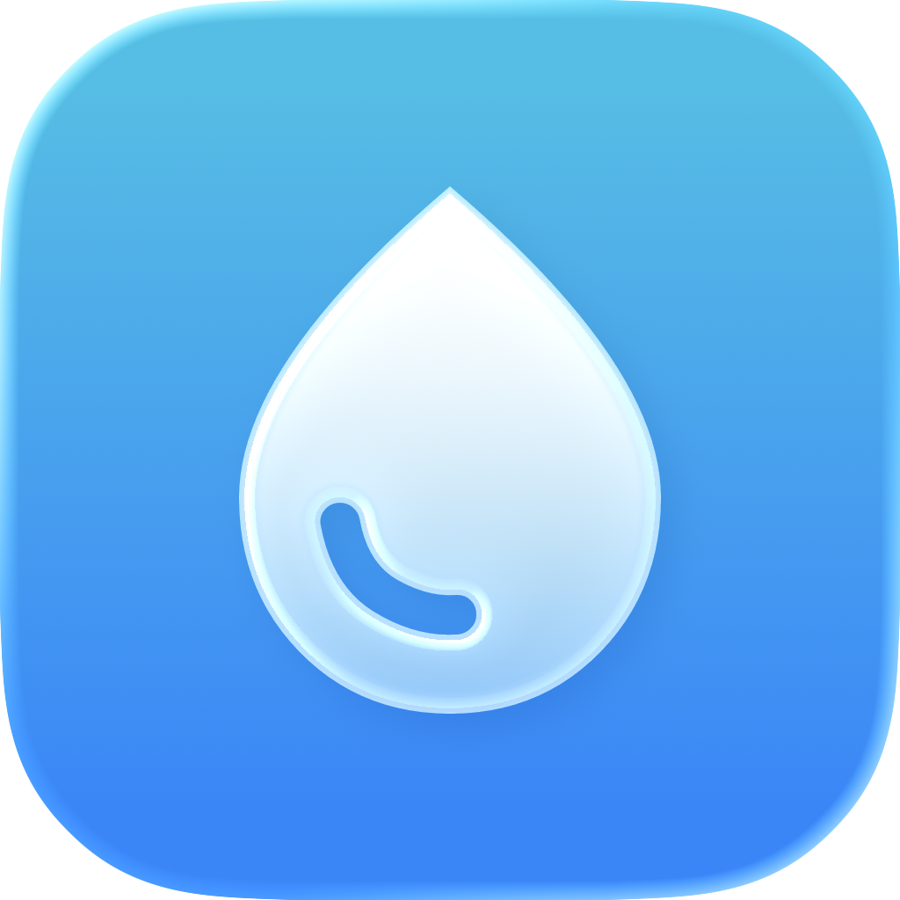

  

  <h1>Mizum</h1>

  
<i>A simple water intake app with Apple Health integration.</i>

  

    
    
  

  

# Mizum

No ads.  
No in-app purchases.  
No subscriptions.  
No third-party analytics.

Mizum is a simple water intake app that integrates with Apple Health.

Track your daily water intake and view it in a clear chart.  
Add water entries quickly throughout the day.  
Set hourly notifications to support consistent water intake.

All data remains on your device.

---

## Features

- Apple Health integration
- Daily water intake chart
- Quick water entry
- Hourly water notifications with customizable quiet hours

---

## Supported Versions

- iOS 17.0 or later

---

## License

This project is licensed under the MIT License. See the [LICENSE](https://github.com/KiyohitoNara/mizum/blob/master/LICENSE) file for detailes.
